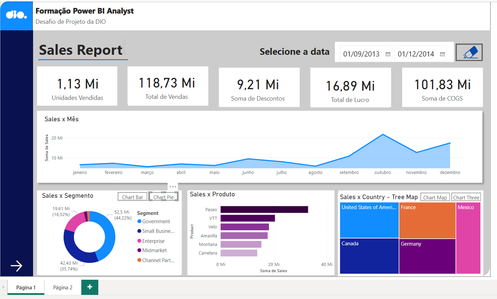
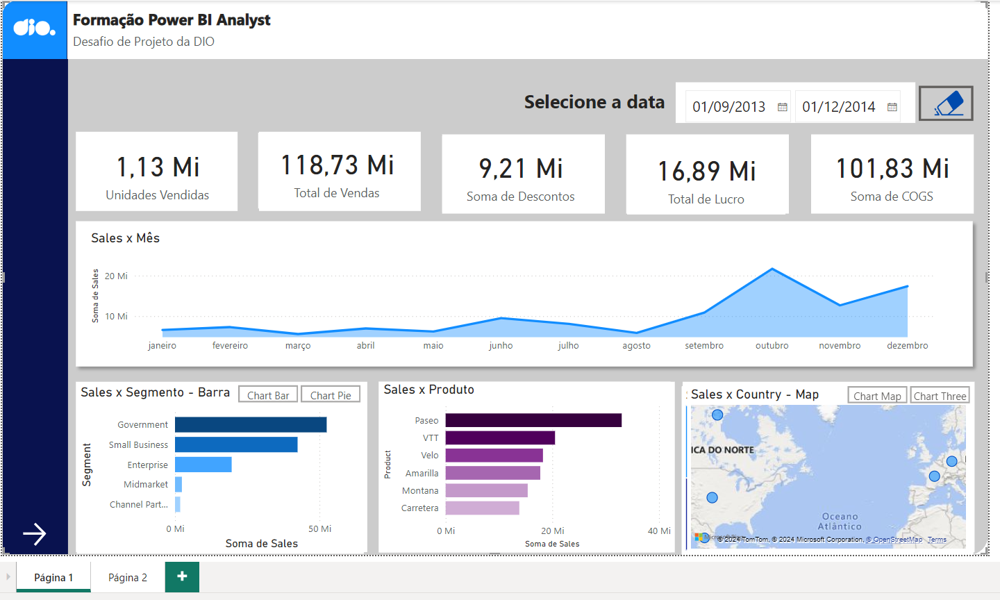
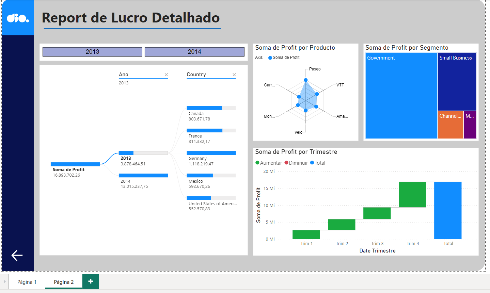

# Relatório Gerencial de Vendas com Power BI
# Este relatório foi elaborado utilizando dados de exemplo do Power BI, como um projeto de desafio do Bootcamp de Python Data Analytics, Módulo Visualização de e Análise de Dados com Power BI.

# Seguem imagens do Relatório elaborado com duas páginas

# Página 1

# Pagina 1 (outros relatórios)

# Página 2

